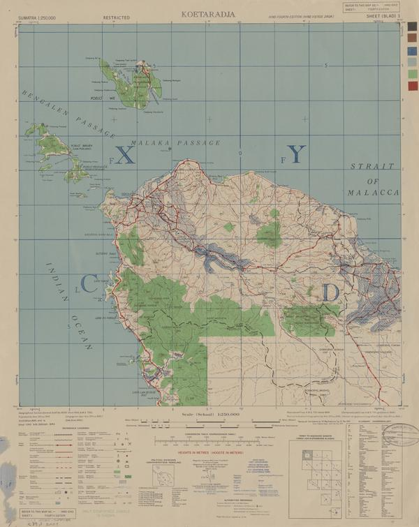

Initially began with looking at map images from [Link to Indonesia maps: dataset 1](https://maps.lib.utexas.edu/maps/ams/indonesia/index.html).

Here is an example image

This project begins by automating processes that previously would have been done manually in tools like Adobe Lightroom. This includes cropping the map image from entire image (excluding legend elements) and converting image to grayscale.

However attempts on extracting road (red elements in these maps) were noisy. This was attributed to other elements that were similar in color to red. A new dataset was found that had roads that were distinctly red. 

