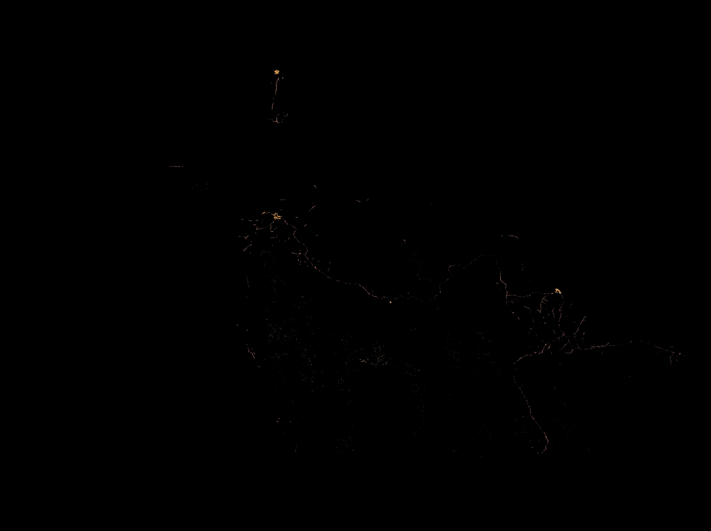
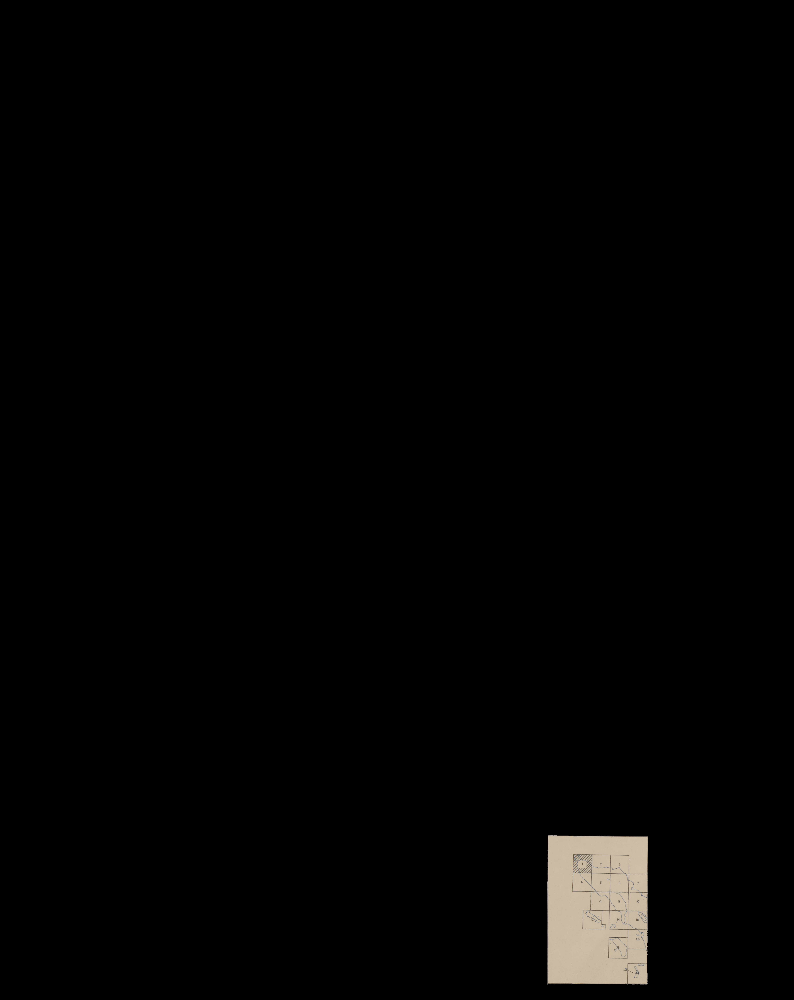
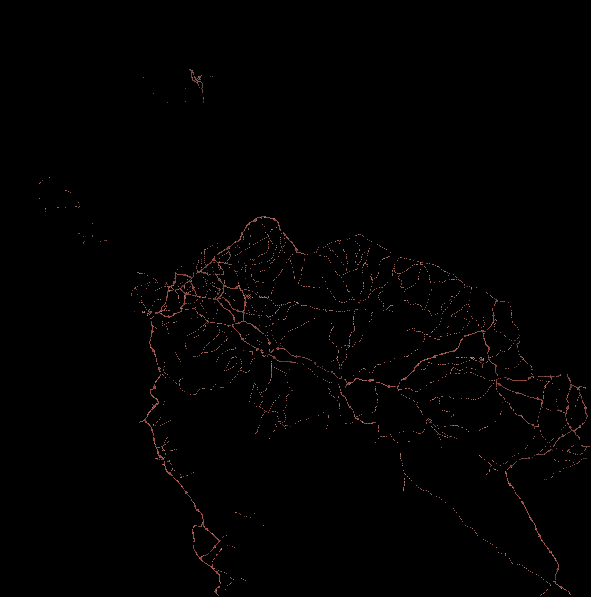
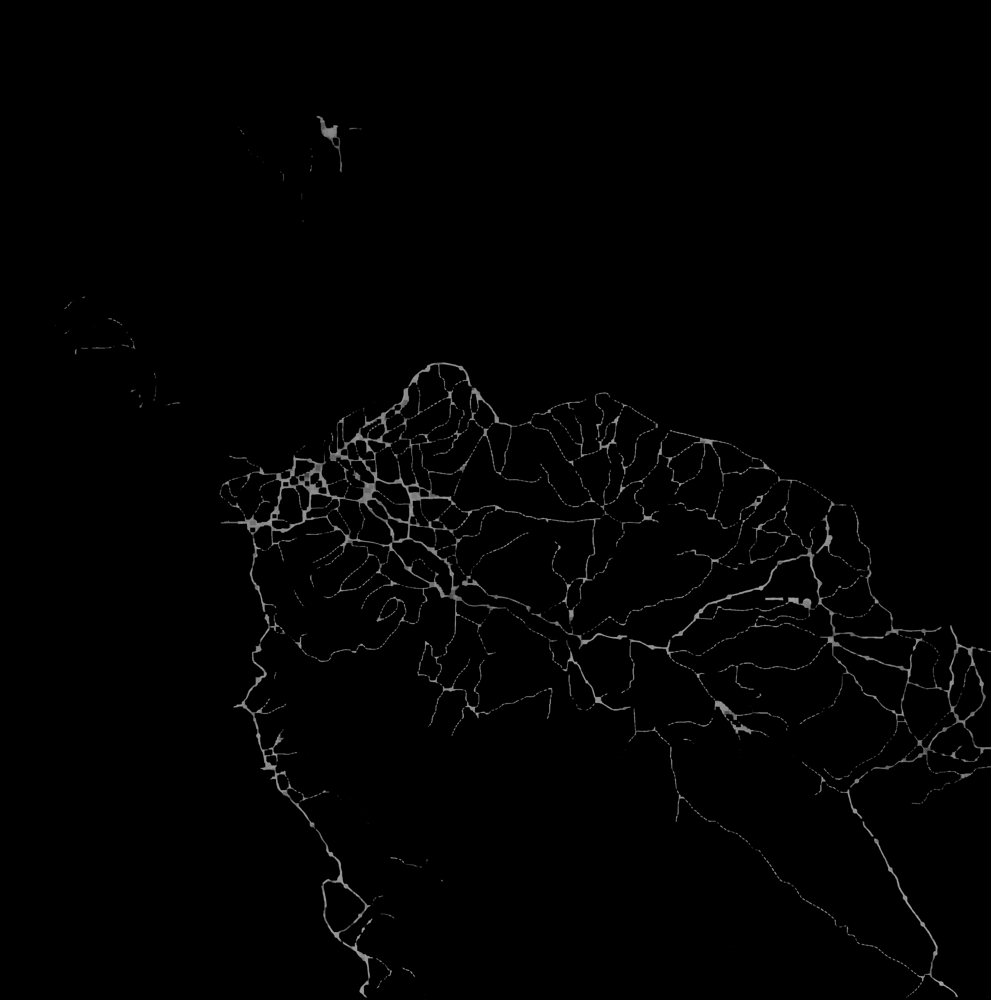
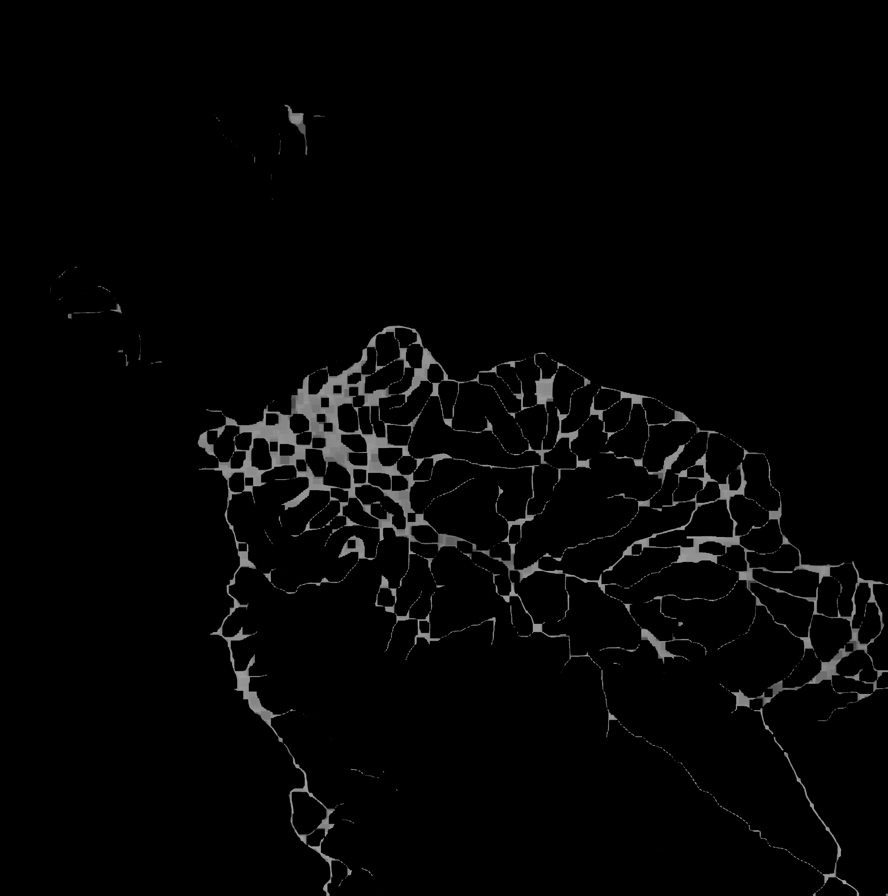

Initially began with looking at map images from [University of Texas Map Collection](https://maps.lib.utexas.edu/maps/ams/indonesia/index.html).

Here is an example image


This project begins by automating processes that previously would have been done manually in tools like Adobe Lightroom. This includes cropping the map image from entire image (excluding legend elements) and converting image to grayscale. 

### digitize_dset1.py
For all python files all one has to do is to change `image_path` to desired image to be process and run the file. After the first `image_path` is specified, often the next path to specify is just the output of the last .py file.

<!-- 
 -->

<p align="center">
  
  
</p>

However attempts on extracting road (red elements in these maps) were noisy. This was attributed to other elements that were similar in color to red. 



A new dataset was found that had roads that were distinctly red. 
Here is an example image


### digitize_dset2.py
Running the unmodified code on new inputs yield completely black images as output. By examining intermediate results, it turns out the lack of a border and the thickness of grids in the new dataset images seem to cause breaks in the contours which means the program does not "see" the map image as a single element. Code had to rewritten to automatically crop map images for the new dataset.

```python
 # Use morphological operations to close small gaps in contours
    kernel = np.ones((5, 5), np.uint8)
    edges = cv2.dilate(edges, kernel, iterations=1)
    edges = cv2.erode(edges, kernel, iterations=1)
```

After modifying code, program is able to create contours around elements again. The output was able to isolate some other legend component, not the map element.



The code has relied on identifying the largest element as the map image, and this is still the case for these new images. Additional, modifying code to filter all extracted elements for those who are roughly square which gets the correct largest element (map).

```python
# Filter contours based on aspect ratio and area
    def is_rectangular(contour):
        x, y, w, h = cv2.boundingRect(contour)
        aspect_ratio = float(w) / h
        return 0.75 < aspect_ratio < 1.25  

    contours = [cnt for cnt in contours if is_rectangular(cnt)]
    largest_contour = max(contours, key=cv2.contourArea) if contours else None
```

Now, repeat the same preprocessing steps as in dataset 1


### isolateRoads_dset2.py



Arriving back at the same point as last data set with isolated red elements. It is much clearer where the roads are.

### connectRoads_dset2.py
Now for dotted lines, connect the segments since in reality these are of course roads without gaps. One approach for closing is to dilate the elements and erode the elements back to thin lines. 


The initial attempt with kernel size of (3,3), makes some progress on connecting the dotted lines. To close gaps which are further away, we use more surrounding pixels in the convolution for each origin pixel, meaning we increase the kernel size.  

<p align="center">
  
  
  
</p>

However the tradeoff of this approach is that there may be loss of fine detail. Here it can be observed that as the kernel size increase, the merge of close but distinct elements are "faster" than improvements in gap-closure for roads. 


